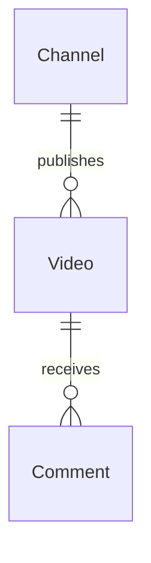

# Engage — Domain Specification

Canonical domain language for Engage, a YouTube channel engagement service. Developers, reviewers, and AI agents must align code, tests, and UI copy with this document.

**Related references:** [ARCHITECTURE.md](../ARCHITECTURE.md).

**Maintenance:** Update this file before merging when domain concepts change (see [.cursor/rules/domain-model.mdc](../.cursor/rules/domain-model.mdc)).

---

## Context

Engage tracks **YouTube channels** registered in the platform, periodically **syncs videos** and **comments** from the YouTube Data API, and exposes them via JSON APIs for consumers (e.g. Backoffice via `/engage/api` proxy).

---

## Ubiquitous Language

### Platform

| Term | Meaning | Code / notes |
|------|---------|--------------|
| **Engage** | YouTube engagement product (this service). | — |
| **Channel** | A registered YouTube channel identified by **YouTube channel id** (`UC…`). | `Channel`, `tb_channels` |
| **Connected channel** | Channel with `connected=true` and a stored **YouTube API key**; eligible for sync and live statistics. | `Channel.connected`, `Channel.youtubeApiKey` |
| **YouTube API key** | Google Cloud key (YouTube Data API v3) stored per connected channel; never returned in API responses. | `Channel.youtubeApiKey`, `CreateChannelRequest.youtubeApiKey` |
| **YouTube channel id** | External id from YouTube (24+ chars, `UC…`). | `Channel.youtubeId`, `yt_id` |
| **Video** | A YouTube video belonging to a channel; metadata synced from API. | `Video`, `tb_videos` |
| **YouTube video id** | External video id. | `Video.youtubeId`, `yt_id` |
| **Comment** | A YouTube comment (top-level or reply) on a video. | `Comment`, `tb_comments` |
| **YouTube comment id** | External comment thread/comment id. | `Comment.youtubeCommentId` |

### Sync

| Term | Meaning | Code / notes |
|------|---------|--------------|
| **Sync** | Pull data from YouTube API into local database. | `syncAt` on entities |
| **Video sync** | Scheduled job fetching new/updated videos per connected channel (one channel + one page per run). | `SyncVideoTask`, every 5m |
| **Comment sync** | Scheduled job fetching one comment page per due video. | `SyncCommentsTask`, every 10m |
| **Next page token** | YouTube pagination cursor for channel video search. | `Channel.nextPageToken` |
| **YouTube service** | Google API client wrapper. | `YoutubeApiFacade` |
| **Sync run report** | Aggregate report for one background sync run (title, description, JSON summary). | `SyncRunReport` |
| **Sync run report item** | One entry per YouTube API call during a run. | `SyncRunReportItem`, `YoutubeApiFacade.recordApiCall()` |
| **Publish notification** | POST sync report to Passport internal API after each run. | `PassportNotificationPublisher` |

### Actions

| Term | Meaning | Code / notes |
|------|---------|--------------|
| **Register channel** | Create local channel row; optionally connect with YouTube API key. | `CreateChannelEndpoint`, `ChannelService`, `POST /channels` |
| **Connect channel** | Set `connected=true` and store API key; validates channel via YouTube. | `UpdateChannelRequest`, `ChannelService` |
| **Update channel** | Change YouTube id, API key, or connected flag. | `ChannelResource` PUT |
| **Delete channel** | Remove channel record. | `ChannelResource` DELETE |
| **List channels** | Return all registered channels. | `ListChannelsEndpoint` |
| **List videos** | Return synced videos paginated, newest first, with comment counts. | `ListVideoEndpoint`, `GET /api/videos?page&size&q` |
| **List comments** | Return comments for a video or all videos in a channel. | `ListVideoCommentsEndpoint`, `ListChannelCommentsEndpoint` |

### Comment model

| Term | Meaning | Code / notes |
|------|---------|--------------|
| **Author name** | Display name from YouTube. | `Comment.authorName` |
| **Author channel id** | YouTube channel id of commenter. | `Comment.authorChannelId` |
| **Like count** | YouTube likes on comment. | `Comment.likeCount` |
| **Reply** | Nested comment under a thread; stored as `Comment` with same video FK. | `SyncCommentsTask.processReply` |

### Seed data

| YouTube channel id | Purpose |
|--------------------|---------|
| `UC6g6eok10NJGYgenHO-0Oew` | Default channel in Flyway migration |

---

## Invariants

1. Each **Channel** has a unique **YouTube channel id**.
2. Each **Video** has a unique **YouTube video id** and belongs to one **Channel**.
3. Each **Comment** has a unique **YouTube comment id** and belongs to one **Video**.
4. Deleting a video cascades to its comments (`ON DELETE CASCADE`).
5. **Register channel** rejects duplicate YouTube ids (409 Conflict).
6. **Connected channel** requires a non-blank **YouTube API key** (400 Bad Request).
7. Sync jobs must not invent ids — always use YouTube API identifiers.
8. Sync and live statistics run only for **connected** channels with an API key.
9. After each sync run, Engage **publishes notification** to Passport; sync must not fail if Passport is unreachable.
